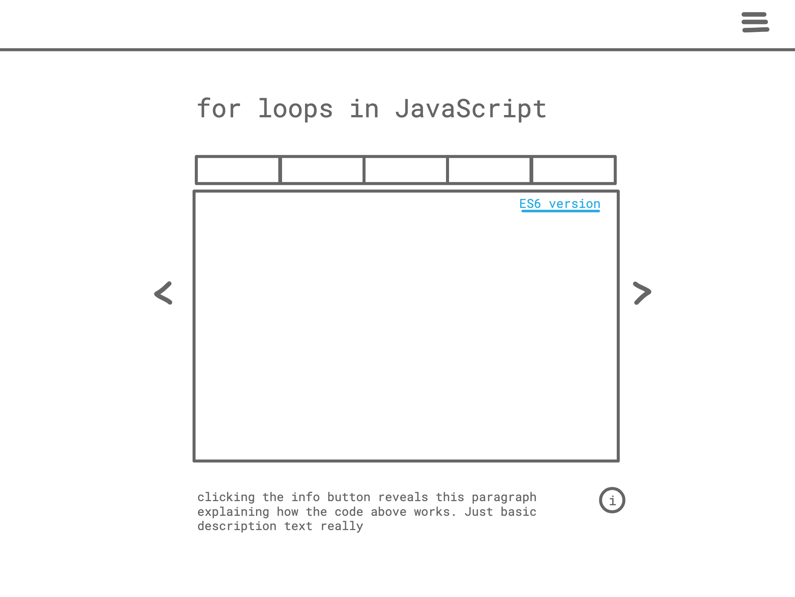

# Code Referencer
## Quickly see how to do different tasks in other languages

---
### **IMPORTANT:** Read CONTRIBUTING.md before leaving comments or creating Pull Requests.
---
Sometimes you need answers for a simple coding concept. You know the syntax in your favorite programming language, but not in another.



**Examples of tasks**
- assign a variable
- display a value
- declare and call a function
- loop an array
- Assign key value pairs to an object
- higher order functions
- etc

Each task has its own page with a box holding the main content, with toggle-able tabs dedicated to different languages. The box has arrows to show the next “slide”.

**Possible tabs**
- Javascript
- ES6 (could be it's own tab or a link on the relevant tasks)
- Ruby
- Python
- Java
- PHP
- C
- R
- etc

Navigation is a dropdown (maybe even a different page) of all the different “tasks” divided out into sections (arrays, variables, functions, etc)

The goal is clear examples. No “foo”, “bar”, “bar” garbage. When possible the example should be the same across languages.

Since this is a static site, without anything complicated like forums or voting on answers, I’m using Svelte + Sapper.

I could either have content underneath the box explaining each task, or an “i” icon you click to toggle whether that content is visible. That seems the best way forward.

### Post MVP features
1. User can have preferred languages by default and those tabs appear first, with a dropdown at the end showing the remaining ones on smaller screens.
2. Toggleable Dark theme. Start with light theme as the default. When user sign in eventually happens this option could be remembered and turn on when logged in.
3. syntax highlighting. This could be tricky with so many languages, but there's probably a prebuilt library for this.
4. If there's a way to handle all of the login features with cookies instead, I'm all ears. There isn't really anything worth protecting behind a log in.

### Running the project

Once you have created the project, install dependencies and run the project in development mode:

```bash
cd site
npm install # or yarn
npm run dev
```

This will start the development server on [localhost:3000](http://localhost:3000). Open it and click around.

You now have a fully functional Sapper project! To get started developing, consult [sapper.svelte.dev](https://sapper.svelte.dev).

For more documentation on Svelte and Sapper, visit SAPPER_README.md.